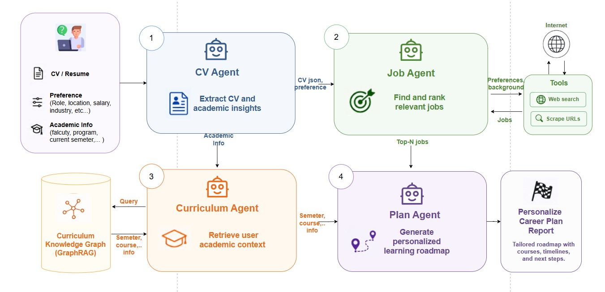

# SPARK-v2 - Smart Pathway Advisor with Reasoning and Knowledge


---

<p align="center">
  
</p>

**SPARK** is an AI-powered career planning system that analyzes your CV, finds matching jobs, recommends courses, and creates a personalized 6-month career roadmap. Four specialized agents work together in a pipeline to deliver real-time career intelligence.

---

## 📋 Table of Contents

- [System Overview](#system-overview)
- [The Four Agents](#the-four-agents)
- [Techn Stack](#tech-stack)
- [Setup & Installation](#setup--installation)

---

## System Overview

<p align="center">
  
</p>

SPARK uses a **4-agent pipeline** that processes your career data in stages:

```
Form Submission → CV Agent → Job Agent → Curriculum Agent → Plan Agent → Career Roadmap
```

Each agent runs independently and streams progress updates in real-time to the dashboard.

**Key Features:**
- Real-time progress tracking with live updates
- Parallel execution where possible
- Structured data extraction from unstructured sources
- Knowledge graph queries for curriculum data
- AI-powered career roadmap generation

---

## The Four Agents

### 1. CV Agent
**Purpose:** Extract structured data from PDF resumes

**Input:** PDF file path  
**Output:** JSON with education, skills, experience, projects, certifications


### 2. Job Agent
**Purpose:** Search web for matching jobs and extract structured data

**Input:** CV data, preferences, background  
**Output:** JSON with job listings (title, company, skills, requirements, etc.)


### 3. Curriculum Agent
**Purpose:** Query DUT curriculum database to find relevant courses

**Input:** Natural language question about courses  
**Output:** JSON with course list and Cypher query

### 4. Plan Agent
**Purpose:** Generate personalized 6-month career roadmap

**Input:** CV data, job data, curriculum data, user preferences  
**Output:** Markdown document with complete career plan

---

## Tech Stack

### Backend
- **FastAPI** - Web framework for REST + SSE
- **LangChain** - LLM orchestration and tool integration
- **LangGraph** - Workflow orchestration for Plan Agent
- **Neo4j** - Graph database for curriculum data
- **PyMuPDF (fitz)** - PDF text extraction
- **BeautifulSoup** - Web scraping
- **Tavily** - Web search API
- **Pydantic** - Data validation
- **Google Gemini Flash Lite** - LLM for all agents

### Frontend
- **Vanilla JavaScript** - No frameworks
- **Server-Sent Events (SSE)** - Real-time updates
- **marked.js** - Markdown rendering for Plan Agent output
- **Tabler Icons** - Icon set

### Database
- **Neo4j** - Curriculum knowledge graph
  - Nodes: Faculty, Program, Semester, Subject
  - Relationships: HAS_PROGRAM, HAS_SEMESTER, HAS_SUBJECT, PREREQUISITE_OF, COREQUISITE_WITH

---

## Setup & Installation

### Prerequisites
- Python 3.11+
- Neo4j 5.0+
- Node.js (optional, for frontend dev server)

### 1. Clone Repository
```bash
git clone https://github.com/minh-quan2811/SPARK-v2.git
cd SPARK-v2
```

### 2. Install Python Dependencies
```bash
cd backend
pip install -r requirements.txt
```

### 3. Configure Environment
```bash
# backend/.env
GOOGLE_API_KEY=your_gemini_api_key
TAVILY_API_KEY=your_tavily_api_key
NEO4J_URI=neo4j://127.0.0.1:7687
NEO4J_USERNAME=neo4j
NEO4J_PASSWORD=your_password
```

### 5. Run Backend
```bash
cd backend
uvicorn main:app --reload --port 8000
```

### 6. Serve Frontend
```bash
cd frontend
python -m http.server 3000
# Or use any static file server
```

### 7. Open Browser
```
http://localhost:3000/index.html
```