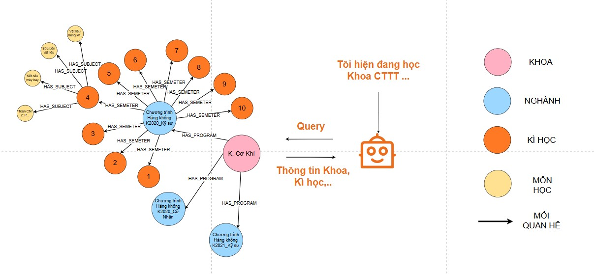

# Curriculum Agent

**What it does:** Answers questions about courses in the DUT curriculum by querying a knowledge graph database.

## How it works

<p align="center">
  
</p>

1. **Get your question** - You ask about courses (e.g., "What courses are in semester 3?")
2. **Generate Cypher query** - AI converts your question into a database query
3. **Query Neo4j** - Runs the query on the graph database
4. **Return courses** - Gives you a list of courses with all details

## The curriculum data

### How we got the data

1. **Scraped DUT website** - Used `scrape_dut_curriculum.py` to download all curriculum information from https://sv.dut.udn.vn
2. **Built knowledge graph** - Used `build_knowledge_graph.py` to organize the data in Neo4j database

The scraper visits the DUT curriculum website, selects each faculty, and downloads:
- Program information (program code, major, credits, language)
- All courses in each program
- Course relationships (prerequisites, corequisites)

### Database structure

The knowledge graph has this hierarchy:

```
Faculty → Program → Semester → Subject
```

**Example:**
- Faculty: "Khoa Điện tử"
- Program: "Công nghệ Thực phẩm K2020CLC"
- Semester: Semester 3
- Subjects: All courses in that semester

### Course relationships

Each course can have connections to other courses:
- **PREREQUISITE_OF** - Must complete before taking this course
- **COREQUISITE_WITH** - Must take at the same time
- **RECOMMENDED_BEFORE** - Should take before (but not required)

## What you can ask

- "What courses are in semester 3 of program X?"
- "Show me all courses in the Công nghệ Thực phẩm program"
- "What are the prerequisites for course 3190111?"
- "Which courses should I take in my 4th year?"

## Output format

Returns a JSON object with:
- Your original question
- The database query used (Cypher)
- List of courses found
- Any error messages

**Example:**
```json
{
  "query": "What courses are in semester 3?",
  "cypher_statement": "MATCH (s:Semester {number: 3})-[:HAS_SUBJECT]->(c:Subject) RETURN c",
  "records": [
    {
      "CourseName": "Giải tích 2",
      "CourseCode": "3190112",
      "Credits": "3"
    }
  ],
  "error": null
}
```

## Why it matters

This agent helps you:
- Understand what courses are available in your program
- Plan which courses to take each semester
- See prerequisites before registering
- Find courses that match your career goals