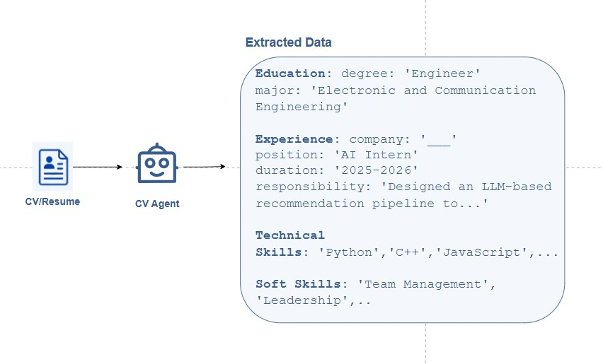

# CV Agent

**What it does:** Reads your CV (PDF file) and extracts all important information into organized data.

## How it works

<p align="center">
  
</p>

1. **Read the PDF** - Opens your CV file and gets all the text from it
2. **Send to AI** - Asks the AI to find and organize information from the text
3. **Parse the response** - Converts the AI's answer into structured data
4. **Validate** - Checks that all data follows the correct format

## What it extracts

### Education
- Degree type (Bachelor, Engineer, Master, PhD)
- Major/field of study
- GPA
- Graduation year
- Current academic year (1-4)

### Experience
- Company name
- Job position
- Work duration
- Skills used in each job

### Skills
- Technical skills (programming languages, tools, frameworks)
- Soft skills (teamwork, leadership, communication)

### Projects
- Project names
- What you built
- Technologies used

### Certifications
- Certificates
- Competition awards
- Honors

## Output format

Returns a JSON object with all extracted information organized by category.

**Example:**
```json
{
  "education": {
    "degree": "Engineer",
    "major": "Electronic and Communication Engineering",
    "gpa": 3.55,
    "academic_year": 4
  },
  "technical_skills": ["Python", "C++", "React"],
  "experience": [...],
  "projects": [...]
}
```

## Why it matters

This agent turns your unstructured CV into clean data that other agents can use to:
- Match you with relevant jobs
- Find skill gaps
- Recommend courses
- Build your career plan