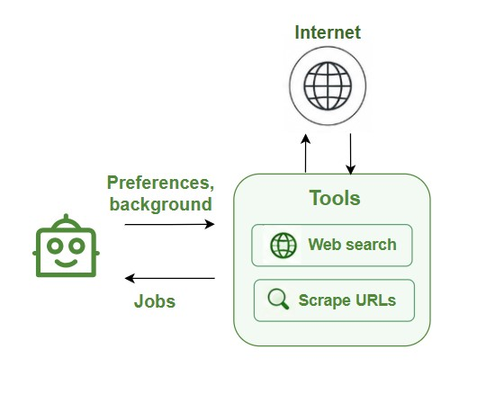

# Job Agent

**What it does:** Searches the web for job listings that match your profile and extracts detailed information from each job.

## How it works

<p align="center">
  
</p>

1. **Build search query** - Creates a good search term based on your major, skills, and preferences
2. **Search the web** - Uses Tavily search to find job listings online
3. **Pick relevant jobs** - Chooses 4-6 URLs that look like real job postings
4. **Scrape job pages** - Visits each URL and extracts the full job description
5. **Extract job data** - AI reads each job page and pulls out structured information
6. **Return results** - Gives you a clean list of jobs with all details organized

## What it extracts from each job

- Job title
- Company name
- Location
- Salary range (if available)
- Required technical skills
- Requirements (education, experience)
- Responsibilities
- Years of experience needed
- Seniority level (Junior/Mid/Senior)
- Employment type (Full-time/Part-time/Contract)
- Remote work option
- Application URL

## Search strategy

The agent searches for:
- Jobs in Vietnam or remote positions open to Vietnam
- Roles matching your major and skills
- Entry-level to mid-level positions (based on your experience)

## Output format

Returns a JSON object with:
- List of job listings (structured data)
- Summary in Vietnamese
- Top job titles found

**Example:**
```json
{
  "jobs": [
    {
      "title": "Junior Python Developer",
      "company": "Tech Company Vietnam",
      "location": "Ho Chi Minh City",
      "technical_skills": ["Python", "Django", "PostgreSQL"],
      "seniority": "Junior",
      "remote": true
    }
  ],
  "summary": "Tìm thấy 5 vị trí phù hợp, chủ yếu là Python Developer và Data Analyst...",
  "top_job_titles": ["Junior Python Developer", "Data Analyst", ...]
}
```

## Live progress updates

While running, the agent sends you real-time updates:
- Which search query it's running
- Which job page it's currently scraping
- How many results found from each search

## Why it matters

This agent shows you:
- What jobs are actually available for someone with your background
- What skills companies are looking for
- What you need to learn to be qualified
- Realistic salary expectations